# F1 · Spike trains and firing rates

!!! abstract "At a glance"

    **Length** — one to two sittings — chapter 1 is conceptual rather than derivational; the long side comes from sitting with the Poisson and Fano-factor material until it is load-bearing rather than merely read · about ~4-4.5 hours (two sittings)
    **Before this** — none — the entry point
    **Reading** — D&A ch. 1 — *Introduction* · *Spike Trains and Firing Rates* · *What Makes a Neuron Fire?* · *Spike-Train Statistics* · *The Neural Code*

[TOC]

## Lecture

Reading alongside **Dayan & Abbott chapter 1**, section by section. Figures are the book's own, by number, so you can find them on the page in front of you.

| Chapter section | Here |
|---|---|
| 1.1 Introduction | What is recorded |
| Spike Trains and Firing Rates | Three rates, and estimating them |
| What Makes a Neuron Fire? | Working backwards from the spikes |
| Spike-Train Statistics | Poisson, and departures from it |
| The Neural Code | The open question |

---

### What is recorded

A neuron at rest sits about 70 millivolts below the surrounding fluid. Depolarise it far enough and a positive feedback process fires: sodium rushes in, the membrane potential swings roughly 100 millivolts, and about a millisecond later it is over. That is an action potential, and for the next few milliseconds the cell is nearly impossible to fire again — the absolute refractory period — followed by a longer stretch, up to tens of milliseconds, where firing is merely harder. That second window is the relative refractory period, and the distinction matters later when we ask what makes a spike train regular.

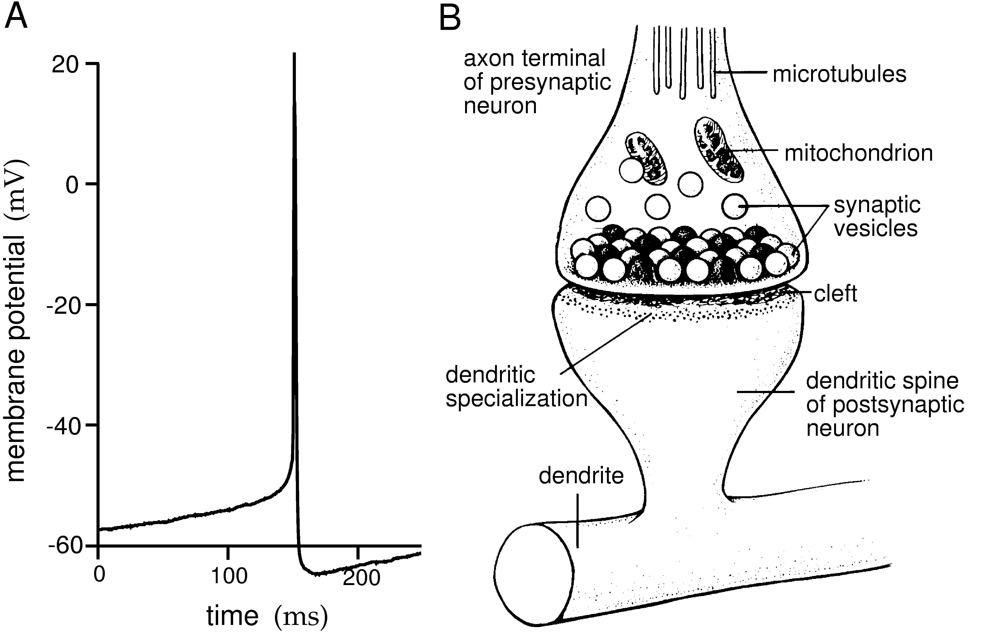

*Figure 1.2 — An action potential recorded intracellularly from a cultured rat neocortical pyramidal cell, with a diagram of a synapse.*

How you record determines what you see. An intracellular electrode sits inside the cell and shows you the membrane potential itself, spikes and all the subthreshold wandering between them. An extracellular electrode sits nearby and picks up only the sharp events, as deflections in a noisy trace.

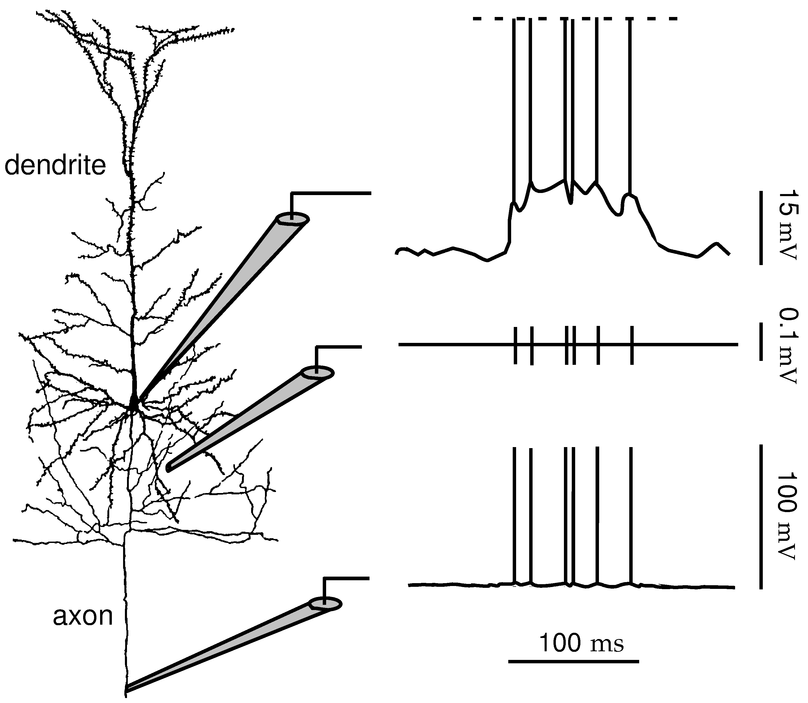

*Figure 1.3 — Intracellular and extracellular recording.*

Here is the first modelling decision of the field, and it is a decision rather than a discovery: **throw the waveform away**. Spikes from one neuron are stereotyped — they all look much the same — so their shape carries little that varies with the stimulus. What varies is when they happen and how many. So the data becomes a list of times, and every quantity built from here sits on top of that list.

### Three rates, and estimating them

Ask what a neuron's firing rate is and you get at least three answers that are not equal to each other.

The **spike-count rate** is a count over a window divided by its length. Twelve spikes in two seconds is six hertz. One number for the whole window, no information about when inside it the spikes fell, and it needs only a single trial.

The **time-dependent rate** is a rate defined at each moment. But a single spike train does not contain one — at any instant there is a spike or there is not — so it has to be estimated by smoothing. That estimate is a choice, not a measurement.

The **trial-averaged rate** repeats the same stimulus many times, lines the trials up and averages across them. Clean, and standard in experiments. It also assumes the neuron does the same thing each time, and an animal behaving in the world only ever gets one trial.

Now the part worth sitting with. To estimate a time-dependent rate you slide something along the spike train: a rectangular window that simply counts, or a smooth bump centred on each spike that you then add up — a Gaussian, or a one-sided decaying kernel if you care that a downstream neuron could only ever look backwards in time.

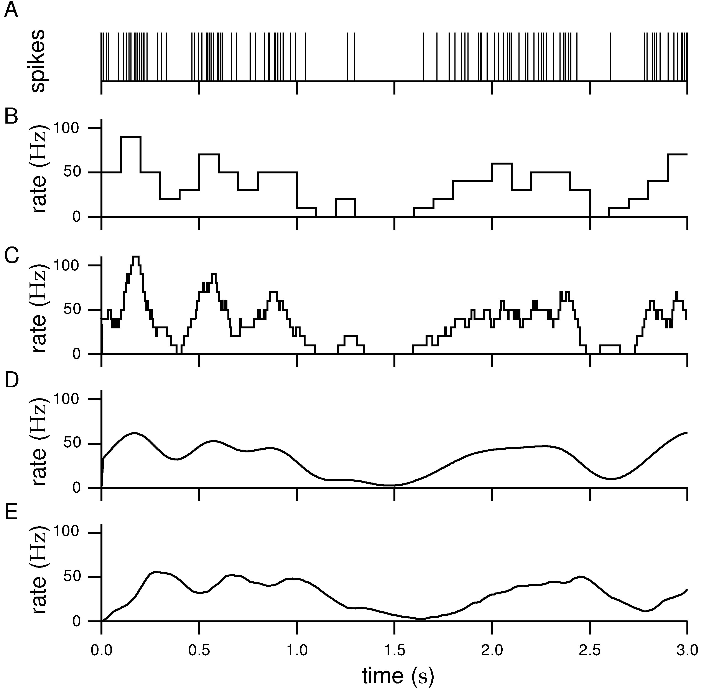

*Figure 1.4 — Four ways of approximating the firing rate from the same spike train: binned, sliding rectangular window, Gaussian kernel, and a causal alpha-function kernel.*

Look at what the same spike train becomes under four different treatments. They are all correct. They disagree. And the disagreement is not noise — it is the trade-off you cannot escape.

A **wide** window averages over many spikes, so the estimate is steady, but it smears anything fast: a transient lasting twenty milliseconds vanishes inside a window of a hundred. A **narrow** window follows fast changes, but at realistic firing rates it contains almost nothing. Take a neuron firing at twenty hertz and a ten-millisecond window: on average that window holds one fifth of a spike. Most windows are empty, giving a rate of zero, and the occasional one holds a spike and reports a hundred hertz. The estimate becomes a spray of zeros and spikes around a true value it rarely takes.

So the width you choose is a hypothesis about which timescale carries the signal, and it enters the analysis disguised as a preprocessing step.

**Tuning curves** come from this. Measure the rate across many stimulus values and plot rate against stimulus. The peak names what the neuron prefers; the width says how sharply it distinguishes. A visual cortex neuron tuned for orientation gives a bump centred on its preferred angle; a motor cortex neuron tuned for reach direction gives a broad cosine.

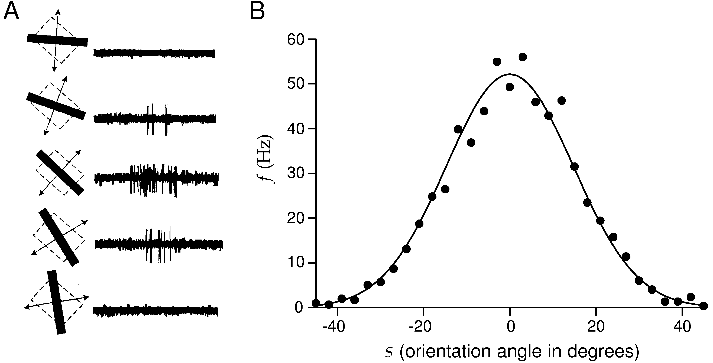

*Figure 1.5 — Orientation tuning of a neuron in monkey primary visual cortex.*

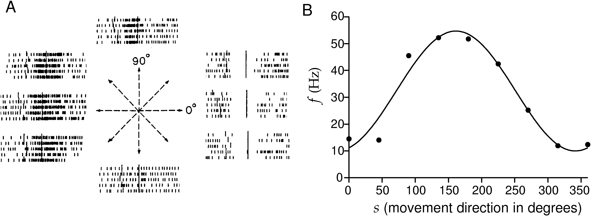

*Figure 1.6 — Direction tuning in monkey primary motor cortex during an arm-reaching task.*

Notice how broad the motor tuning is. A single such neuron barely constrains the reach direction at all — which is a problem that only resolves when we get to populations, in F3.

### Working backwards from the spikes

Everything so far asks: given a stimulus, what does the neuron do? Turn it around. Given that the neuron just fired, what was the stimulus doing?

Take the stretch of stimulus immediately before each spike, and average those stretches over every spike in the train. What survives the averaging is whatever reliably precedes firing; what was incidental averages away.

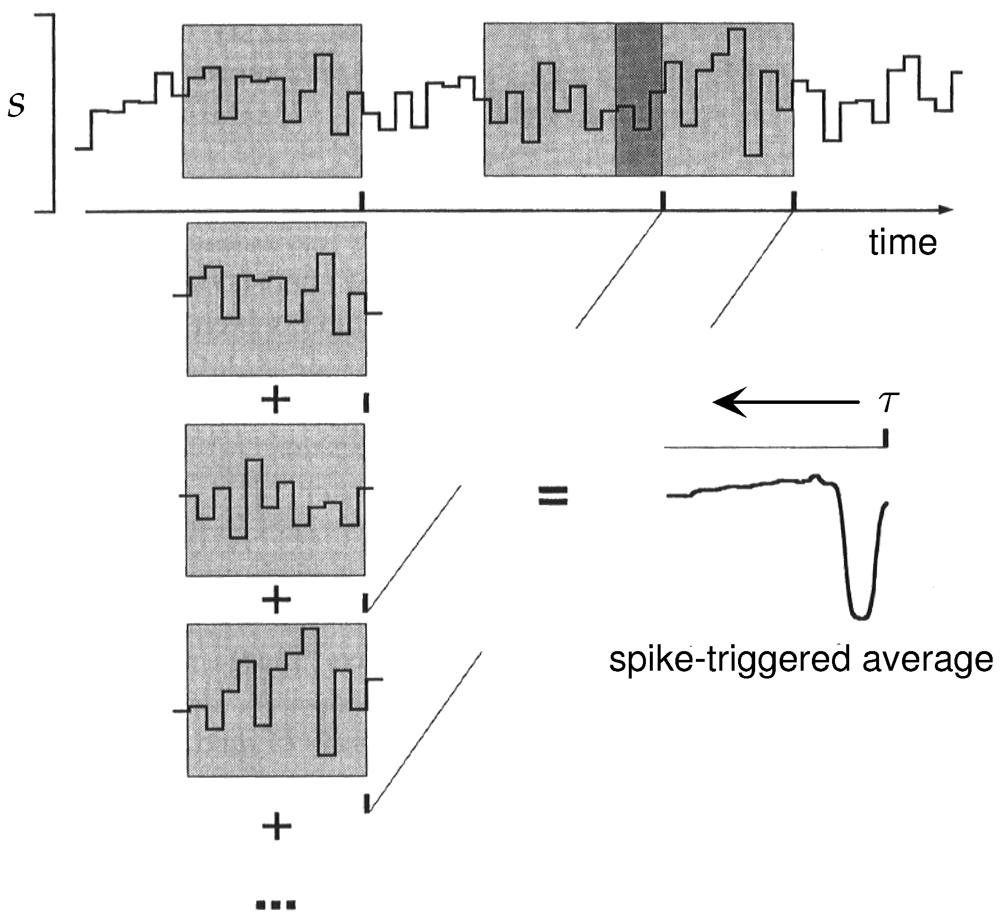

*Figure 1.8 — Computing the spike-triggered average: stimulus segments preceding each spike are extracted and averaged.*

That is the **spike-triggered average**, and it is the workhorse of sensory neuroscience. Two things to hold onto. It runs *backwards* from each spike, which is why it is also called reverse correlation. And it only means anything if the stimulus itself has no structure to impose on the answer — which is why the stimulus of choice is white noise, random and uncorrelated across time.

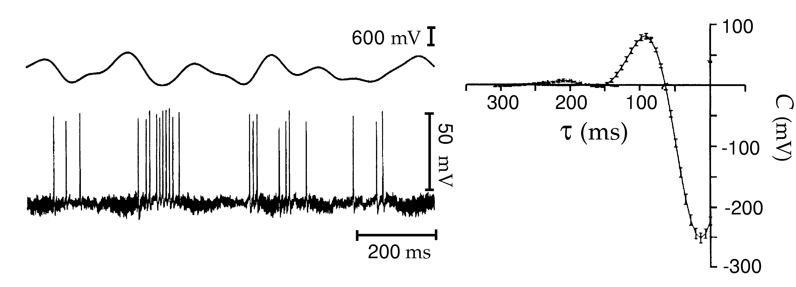

*Figure 1.9 — The spike-triggered average stimulus for a neuron of the electrosensory lateral-line lobe.*

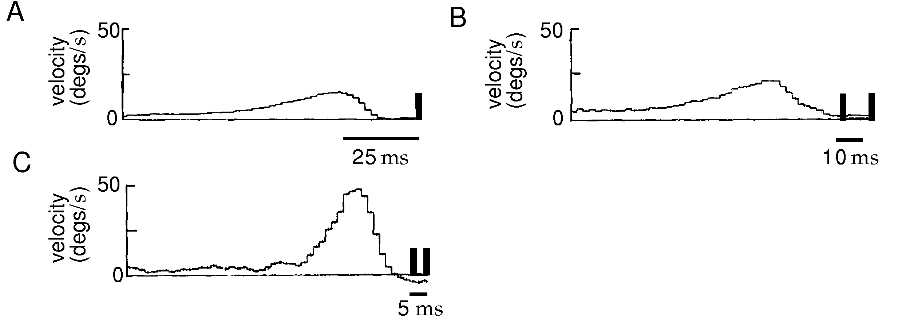

*Figure 1.10 — Single- and multiple-spike-triggered average stimuli for a blowfly H1 neuron.*

That blowfly H1 neuron is not an illustration you will only read about. Twenty minutes of recording from exactly this preparation ships with the book's exercises, and chapter 1's problems 8 through 10 have you compute these averages yourself from the raw data.

### Poisson, and departures from it

Repeat a stimulus and the spikes land differently each time. How differently?

The reference model is the **Poisson process**: spikes independent of one another, no memory of what came before. Two consequences follow. Intervals between spikes are exponentially distributed, so the most common interval is a very short one even when the average interval is long. And the **Fano factor** — the variance of the spike count divided by its mean, across repeated windows — is exactly one, whatever the window length.

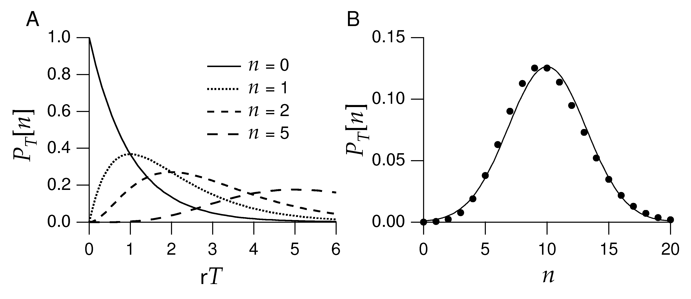

*Figure 1.11 — The probability that a homogeneous Poisson process generates a given number of spikes, and the resulting interval distribution.*

Cortical neurons are roughly Poisson-like, which is an awkward result rather than a satisfying one: it means much of their variability looks like noise.

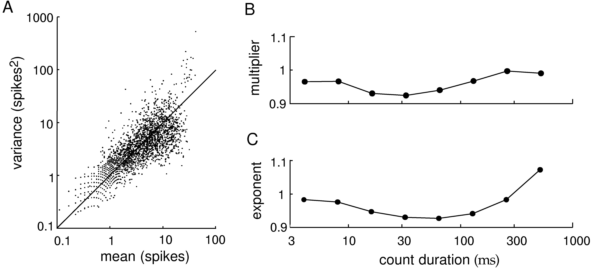

*Figure 1.14 — Variability of MT neurons in alert macaque, with variance plotted against mean spike count.*

But they depart from Poisson in structured ways, and the departures carry information. The refractory period is the clearest case. Having fired, the cell cannot fire again for a millisecond or two, which forbids precisely the very short intervals Poisson produces freely. Suppressing short intervals makes the train **more regular** — and regularity shows up as a Fano factor below one. For a renewal process the Fano factor over long windows approaches the squared coefficient of variation of the intervals, so you can predict the size of the effect before measuring it. Bursting pushes the other way: spikes clump, variance rises, the factor exceeds one.

The same structure appears in the time domain as an **autocorrelation** — count how often two spikes occur at a given separation — where the refractory period carves a dip at short lags.

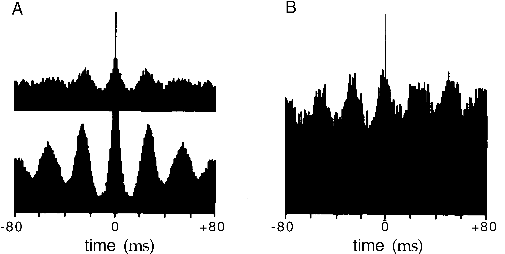

*Figure 1.12 — Autocorrelation and cross-correlation histograms for cortical neurons.*

So the Fano factor is a compact diagnostic. One means Poisson-like. Below one, something imposes regularity. Above one, something imposes clumping.

### The open question

All of this serves one question: how does a spike train carry information?

An **independent-spike code** assumes each spike contributes separately, so the rate is a sufficient description. A **correlation code** holds that the relative timing of spikes carries something the rate does not. Across many cells, a **population code** spreads the message out, and the question becomes whether correlations between cells matter or whether the cells can be read independently.

Underneath sits rate against timing, and it is genuinely unsettled. For rate: cortical firing is highly variable, rates track stimuli systematically, and rate-based models explain a great deal of behaviour. For timing: sound localisation resolves differences between the ears of tens of microseconds, which no rate code could carry, and some decisions happen faster than a downstream neuron could average anything.

The likely answer is both, in different systems and at different timescales. Hold it open. It comes back in every lesson after this one.

## Lesson spec

**Goal:** Understand that a spike train is the raw observable and "firing rate" is a construct built on top of it, with several non-equivalent definitions. Close the misconception that neural data arrives pre-packaged as a rate — it has to be estimated, and the estimation method changes the answer. Come away treating "the neural code" as an open question rather than settled background.

??? note "Scope — what the lesson covers"

    - The spike as an event: why the waveform is discarded and only timing kept
    - Three notions of rate — spike-count, time-dependent r(t), trial-averaged — and when each is the only one the data supports
    - Rate estimation mechanics: binning, sliding windows, kernel smoothing, and the bias/variance trade-off each introduces
    - Poisson spike generation, the interspike-interval distribution, the Fano factor, and concrete ways real cortical trains depart from Poisson
    - The spike-triggered average introduced as the chapter introduces it (*What Makes a Neuron Fire?*), with the development left to F2
    - Independent-spike, correlation and population codes; rate versus temporal coding stated as unresolved, not adjudicated
    - Not covered: decoding a stimulus from spikes (F3), information-theoretic treatment (F4), the biophysics that produces a spike (F5)

**You should be able to answer:**
1. Given a spike train with 12 spikes in a 2-second window, compute the spike-count rate, then say what additional data you would need to compute r(t) at t = 0.5 s.
2. For a Poisson process at 20 Hz, what is the Fano factor over any counting window, and what value in real data would tell you the neuron is *more* regular than Poisson?
3. A 100 ms sliding window versus a 10 ms one on the same train — which costs temporal resolution, which costs a noisy estimate, and why can you not avoid both?
4. Sketch a tuning curve for an orientation-selective neuron: where is the rate maximal, and what does the curve's width mean operationally?
5. State one concrete experimental observation arguing for temporal coding over pure rate coding, and one arguing against.

**Feeds:** F3 (decoding assumes the encoding model given here), F4 (information theory needs these statistics), F6 (integrate-and-fire generates the trains characterised here), and the whole A track.

**Done when:** You can take a raw spike train, produce two different rate estimates, defend and critique each, and articulate why "the firing rate" is not a single well-defined number.

---

## Authors' exercises

Dayan & Abbott wrote exercise sets for every chapter and publish them free at gatsby.ucl.ac.uk/~dayan/book. This lesson's are in `exercises/c1.pdf` (chapter 1), with any code and data under `exercises/exercises/c1/`. **Work all ten.**

They are the authors' problems, not this course's, so they take precedence where the two overlap: if an exercise here duplicates one of theirs, do theirs. They are written for MATLAB; translating to numpy is part of the work and is not hard. The teacher agent has no answer key for these — it marks by reading your code and output, and says so rather than pretending to a key it does not have.

## Coursework

Consume, then apply, then refine: **guided reading (Piece 3) → derivation (Piece 1) → simulation (Piece 2) → written explanation (Piece 4)**. Pieces are numbered by type, not sequence.

??? note "Coverage map"

    | Piece | Type | Lesson acceptance criteria addressed |
    |---|---|---|
    | 1 | derivation | 1, 3 |
    | 2 | simulation | 2, 3 |
    | 3 | guided reading | 2, 3, 4, 5 |
    | 4 | written explanation | 4, 5 |

=== "Piece 1 — Rate arithmetic and the bias/variance cost of a counting window"

    **Type:** derivation · **Time:** 45 min

    **Learning goals**
    - Compute a spike-count rate correctly and identify what it does and doesn't tell you.
    - Recognize that "the rate at time t" requires different data than "the rate over a trial."
    - Derive, with real numbers, why shrinking a counting window trades resolution for noise — not as a slogan but as an equation.

    **Task**

    Part A. A neuron fires 12 spikes in a 2.0 s recording window.
    1. Compute the spike-count rate.
    2. Now suppose you want r(t) at t = 0.5 s specifically, not the rate over the whole 2.0 s. List exactly what additional data or experimental design you would need that a single 2-second count does not give you, and explain why a single trial is fundamentally limited for this if r(t) is meant to represent the stimulus-driven expected rate rather than one sample path.

    Part B. Model spiking as a homogeneous Poisson process with true rate r = 20 Hz. A rate estimate from a counting window of width T_w is r̂ = n / T_w, where n is the spike count in that window, n ~ Poisson(r·T_w).
    1. Using the Poisson property Var(n) = E[n], derive E[r̂] and Var(r̂) as functions of r and T_w.
    2. Plug in r = 20 Hz and compute Var(r̂) and the standard deviation of r̂ for T_w = 0.1 s (100 ms) and for T_w = 0.01 s (10 ms).
    3. State which window gives better temporal resolution and which gives a lower-variance estimate, and use your two computed standard deviations to say quantitatively (not just "it's noisier") how much worse the 10 ms window's estimate is.

    **Deliverable**

    A worked derivation (pen and paper or typed) showing: the Part A rate and the two required-data points; the Part B general formulas for E[r̂] and Var(r̂); both numeric evaluations with units; and one sentence stating the trade-off in the concrete terms of your two SD numbers.

    ??? info "Rubric — how this is marked"

        | Band | Criteria |
        |---|---|
        | Strong | Part A rate correct; identifies both that r(t) needs either time-resolved data around t=0.5s (a window/kernel placed there) *and* that estimating the stimulus-driven expected rate needs repeated trials, not one sample path. Part B: correctly uses Var(n)=E[n] to get Var(r̂) = r/T_w; both numeric SDs correct to 2 s.f.; states the trade-off using the actual ratio of the two SDs. |
        | Adequate | Part A rate correct; mentions repeated trials OR time-resolved data but not both. Part B formula and both numbers correct, but the trade-off statement is qualitative only. |
        | Not yet | Rate computed wrong, or Var(r̂) derived without using the Poisson mean=variance identity, or only one window's SD computed. |

    !!! note "Grader key hidden"

        The marking criteria for this piece are in the teacher build.

=== "Piece 2 — Simulation: three rate estimators and a Fano factor that isn't always 1"

    **Type:** simulation · **Time:** 90 min

    **Learning goals**
    - Generate a Poisson spike train computationally and confirm its statistics match theory.
    - Implement and compare three concrete rate-estimation methods on the same data.
    - Observe the Fano factor drop below 1 under an imposed refractory period and connect that to real cortical spike-train regularity.

    **Task**

    Write a self-contained Python script (numpy, no downloads) with two conditions.

    *Condition A — homogeneous Poisson.* Generate spike trains at true rate r = 20 Hz, using 1 ms bins (dt = 0.001 s), duration T = 10 s per trial, n_trials = 50, with a spike in a bin drawn as `rng.random() < r*dt` (use `numpy.random.default_rng(0)` for reproducibility). From this data compute:
    1. The spike-count rate of trial 0 alone (total spikes / T).
    2. A sliding-window rate estimate on trial 0: window = 100 ms, step = 10 ms, rate = count-in-window / window-width, evaluated at each step across the whole trial. Report the mean and standard deviation of this rate series.
    3. A kernel-smoothed rate estimate on trial 0: Gaussian kernel, σ = 25 ms, convolved with the (dt-binned) spike train and normalized so the output is in Hz. Report mean and standard deviation.
    4. A trial-averaged rate (PSTH): bin all 50 trials at 10 ms resolution, average the per-bin counts across trials, convert to Hz. Report the mean and standard deviation of this PSTH.
    5. A Fano factor: split each trial into non-overlapping 100 ms counting windows, pool all (n_trials × 100) window-counts across all trials, compute Var(counts)/Mean(counts).

    *Condition B — renewal process with an absolute refractory period.* Generate spike trains with the same target mean rate (20 Hz) but with inter-spike intervals drawn as ISI = τ_ref + Exponential(mean = 1/r − τ_ref), where τ_ref = 5 ms (so the exponential part has mean 45 ms, giving overall mean ISI 50 ms ⇒ 20 Hz). Same T, n_trials. Compute the achieved mean rate and the Fano factor using the same 100 ms pooled-window method as Condition A.

    **Deliverable**

    The script, plus a short printed/reported summary of all the numbers above for both conditions, compared against the stated expectations below.

    ??? info "Rubric — how this is marked"

        | Band | Criteria |
        |---|---|
        | Strong | All 5 Condition-A quantities computed correctly; Fano factor for Condition A lands close to 1 (roughly 0.85–1.15 given finite sampling); Condition B correctly implemented as a renewal process with the specified ISI construction, achieved rate ≈20 Hz, and Fano factor clearly below 1 (roughly 0.7–0.9). Reader explicitly connects the Condition B result to "more regular than Poisson." |
        | Adequate | Condition A done correctly and Fano ≈1, but Condition B's refractory mechanism is implemented in a way that doesn't preserve the 20 Hz target rate (e.g. just deleting spikes from a Poisson train without correcting the underlying rate), even if the Fano factor still drops below 1. |
        | Not yet | Fano factor computed as a single across-time variance/mean on one trial rather than pooling across repeated windows/trials (statistically underpowered), or Condition A Fano factor is far from 1 due to a coding bug (e.g. wrong dt/rate units), or Condition B is just Condition A with spikes thinned at random (not an actual dead-time/refractory mechanism). |

    !!! note "Grader key hidden"

        The marking criteria for this piece are in the teacher build.

=== "Piece 3 — Guided reading"

    **Type:** guided reading · **Time:** 60 min

    **Source sections:** D&A ch. 1 — *Introduction* · *Spike Trains and Firing Rates* · *What Makes a Neuron Fire?* · *Spike-Train Statistics* · *The Neural Code*.

    **Learning goals**
    - Ground the Fano-factor, tuning-curve, and coding-debate material in the book's actual arguments, not the simulation's numbers alone.
    - Be able to state, from the text, the operational meaning of tuning-curve width and the specific evidence cited for and against rate coding.

    **Task**

    Answer each question with reference to the named section. Write 2-5 sentences per answer; where a sketch is asked for, draw it by hand or describe it precisely enough that shape and axis values are unambiguous.

    1. (*Introduction* / *Spike Trains and Firing Rates*) In your own words, why is the detailed shape of the action-potential waveform typically discarded in analysis, keeping only spike timing? What justification does the text give?
    2. (*Spike-Train Statistics*) For a Poisson process, state the Fano factor over any counting window (you may use the Var(n)=E[n] identity). What Fano factor value, if measured in real spike counts, would tell you the neuron fires more regularly than a Poisson process, and what value would indicate it's burstier?
    3. (*Spike Trains and Firing Rates* / *Spike-Train Statistics*) The book's treatment of rate estimation involves a choice of window or bin width. State, in the text's own terms, which of a 100 ms window and a 10 ms window costs temporal resolution and which costs a noisy estimate, and explain in 1-2 sentences why no single window width escapes both costs.
    4. (*Spike Trains and Firing Rates*) Using the orientation-tuning example, sketch a tuning curve for an orientation-selective neuron with preferred orientation 90°. Axes: x = stimulus orientation in degrees (range 0-180°), y = firing rate in Hz. Mark where the rate is maximal. Then state what the width of the curve means operationally — i.e., what would distinguish, in terms of how well a downstream reader could discriminate two nearby orientations, a narrowly-tuned neuron from a broadly-tuned one.
    5. (*The Neural Code*, and *What Makes a Neuron Fire?* if the observation appears there instead) State one concrete experimental observation the text raises that argues *for* temporal coding carrying information beyond the rate, and one observation that argues *against* needing anything beyond rate coding.

    **Deliverable**

    Written answers to all five questions, referencing the named sections.

    ??? info "Rubric — how this is marked"

        | Band | Criteria |
        |---|---|
        | Strong | All five answers correctly grounded in the named sections' actual content (verified against the text — see grader note below), not generic neuroscience trivia; Q2 states Fano=1 for Poisson and correctly identifies Fano<1 as more-regular; Q3 identifies the resolution/noise split and gives a real reason (not just "trade-offs exist") for why one width can't have both; Q4's sketch has a correctly shaped curve peaking at 90° with a stated discrimination-relevant meaning of width; Q5 gives two genuinely distinct, section-grounded observations rather than one restated twice. |
        | Adequate | Four of five answers meet the Strong bar; the fifth is present but vague or not clearly tied to the named section. |
        | Not yet | Answers are generic (could have been written without the book), Fano factor direction in Q2 is backwards, or Q5 gives only one side of the debate. |

    !!! note "Grader key hidden"

        The marking criteria for this piece are in the teacher build.

=== "Piece 4 — Written explanation"

    **Type:** written explanation · **Time:** 45 min

    **Learning goals**
    - Articulate, without notation, why "the firing rate" is not one well-defined number.
    - Use the tuning-curve and coding-debate material as concrete evidence rather than abstract caveats.

    **Task**

    Write 300-600 words explaining to a first-year PhD student who has just recorded their first spike train — and who assumed "firing rate" was a simple, unambiguous number the recording rig would just hand them — why that assumption is wrong. Your explanation must:
    - Distinguish the three notions of rate (spike-count rate over a window, time-dependent r(t), trial-averaged rate) and give a concrete case where two of them would give different answers for the same underlying data.
    - Explain, using the window-width trade-off (you may reuse your Piece 1 numbers or Piece 2 results as a concrete illustration), why picking a rate-estimation method is itself a decision with consequences, not a neutral default.
    - Use the orientation tuning-curve example to make one concrete point about what a "rate" means for a single neuron representing a continuous stimulus variable.
    - State that whether the nervous system itself uses rate alone or something more (temporal coding) is an open question, backed by one concrete piece of evidence from Piece 3.

    **Deliverable**

    A single piece of prose, 300-600 words, no headers/bullets required (plain explanation is fine), addressed to the imagined student.

    ??? info "Rubric — how this is marked"

        | Band | Criteria |
        |---|---|
        | Strong | All four required elements present and correctly explained with a concrete example each (not abstract restatement); demonstrates the writer actually computed/observed the numbers in Pieces 1-2 rather than gesturing at "trade-offs exist"; correctly states the coding debate as open with a real piece of cited evidence; within word count. |
        | Adequate | Three of four elements present correctly; word count close to range; explanation is correct but leans more on assertion than concrete example in one spot. |
        | Not yet | Treats "firing rate" as if it has one correct definition after all, omits the open-question framing (states rate or temporal coding as settled), or is generic enough that it doesn't require having done Pieces 1-3. |

    !!! note "Grader key hidden"

        The marking criteria for this piece are in the teacher build.

## Completion bar

- [ ] Piece 1: both parts derived with correct numbers and units; trade-off stated as a ratio, not just a description.
- [ ] Piece 2: script runs standalone, no downloads, under ~100 lines; both conditions implemented as specified; Fano factor for Condition A ≈1 and for Condition B clearly <1, with numbers reported.
- [ ] Piece 3: all five questions answered with content traceable to the named D&A ch. 1 sections (teacher has spot-checked against the physical book).
- [ ] Piece 4: 300-600 words, all four required elements present, coding debate framed as open with real supporting evidence.
- [ ] Reader can, unprompted, give two different numeric answers to "what is the firing rate of this train" depending on method, and explain why both are legitimate.
